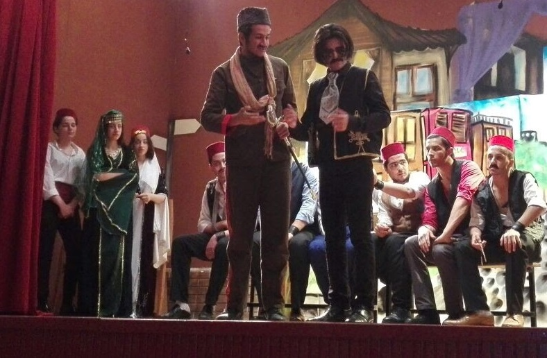

## [Start](#start)

Hi, I'm Emre

I develop software to make a difference in the world. Thank you for taking the time to read my resume.

### Summary

I am an autodidact developer, having taught myself various new technologies while frequently working with start-ups. I love programming and crave to make a difference in the world. <hide>I believe I can add value to your company in reaching its objectives.</hide>

## [Work Experience](#work-experience)

### Self Employed

#### Full-stack Developer

- February 2021 - February 2022 _12 months_
- Turkey - Istanbul/Balat

I developed products for companies as a freelancer and I've completed a lot of projects successfully. <hide placeholder="<b>Some of the projects I've worked on:</b>"/>

<hide>The work I did in my full-stack role</hide>

1. An [economics dictionary app](https://play.google.com/store/apps/details?id=com.demirkentegitimvakfi.ekonomisozlugu). I accomplished the whole process of designing and developing to publishing in a short period of time.
2. A mobile Flutter app that I did maintenance on. This was a private app that interacts with noise canceller headphones via Bluetooth and measures environment sound, applying noise reduction if required. I learned flutter basics with a Bluetooth module, fixed some tiny bugs, and improved the data structures.
3. An admin dashboard related to my second gig. It visualizes incoming data from the mobile app.
4. A [carbon calculator](http://calculator.sour.studio) web app that calculates the greenhouse gas impacts of construction activities. I implemented the company's calculation formulas and I created the interface.
5. A private bet blog with a content management system. The system was able to do things that WordPress can't do like managing multiple posts on different tabs at the same time or injecting customizable components into a blog post. Besides that, it was able to generate AMP pages and important SEO features like structured data and sitemap.
6. A business website and CMS. I created the digital existence of [Estefulya](https://www.estefulya.com). I designed the website and the logo, and I've spared so much time on SEO and got great metrics. The CMS was Netlify's. There is no back-end and everything is working on the Jamstack workflow. I also helped them with the emails, business analytics, and registering their company on some platforms.
7. A simple [liquor website](https://onlinetekelortakoy.netlify.app)

> Outside of my gigs, I wasn't idle. I was learning new technologies and working on my [open-source](https://github.com/m-emre-yalcin/mavi) and [side project](https://lorinto.com/login).

### Bontesoft

#### Front-end Intern, Front-end developer, Full-stack developer

- February 2020 - February 2021 _12 months_
- Turkey - Istanbul/Besiktas

> This was a start-up company in Istanbul. Here, I started as an intern but took on too many responsibilities because I love what I am doing and become a front-end developer shortly. I also had a chance to prove my old back-end skills by solving some problems beyond my duties while had completed a couple of front-end projects. A few months later, I become a full-stack developer. After the promotion, I heavily worked on the MVP apps with the designer and fulfilled the customers' needs with the product manager.

<hide placeholder="<b>In my front-end role,</b> I maintained the company's existing SaaS. I built an interactive interface for an e-commerce website and I built a landing page for a bank. <b>When I become full-stack</b> I've completed 3 MVP apps. I had always written the interfaces from scratch, exactly as their design. I modeled relational databases and created REST APIs. I implemented RTC and cron schedulers...">

The work I did in my front-end role

1. I maintained the company's existing SaaS. The front-end codes I've worked on were legacy codes. I usually wrote CSS and JS.
2. I built the interactive interface of an e-commerce website by working collaboratively with the designer and the back-end developer
3. I built a landing page for a bank.

The work I did in my full-stack role

1. An MVP that sends user forms to a company's open applications. Company members were able to see incoming applications in real-time and evaluate them. _Design, front-end, and back-end development_
2. An MVP that helps you to manage projects and tasks like Asana, but in a simple form. _I worked with the designer on the UI, created an interactive interface with Vue, and built the API and CMS by using Strapi._
3. An MVP mobile web app for cooking recipes. _I used Vue to create the UI, and built the API and CMS by using Strapi_

</hide>

Also, when the resources were not enough I was assigned to fix the company's other project tasks. I usually fixed front-end bugs. Once I solved a complicated SQL problem in the company's SaaS. The existing query was so slow and I helped to reduce the response time from ~30 sec to ~5 sec.

<hide placeholder=" "></hide>

### BSM Technical Project LTD

#### Web Developer

- June 2019 - December 2019 _7 months_
- Turkey - Istanbul/Sisli

This was a newly founded company in the construction area. I was there from the very beginning and my work was versatile. I had done programming, designing, copywriting, and sometimes social media editor.

<hide placeholder="
<b>In my web designer role,</b> I designed their logo, their promotional stuff like brochures, and their business cards. I wrote an admin panel that can send offering emails according to the company's stocks and converts approved offers into billings (JQuery and PHP). I created their <a href='http://bsmproje.com/'>website</a> and I wrote the whole content as I can.">

The work I did in my web developer role

1. I designed their logos. I designed promotional stuff like brochures, business cards, and email templates.
2. I wrote an admin panel that was able to send offering mails according to your stocks and convert them into billings if they are approved. (JQuery and PHP)
3. I created their [website](http://bsmproje.com/) and I wrote the whole content for the website as much as I can.
4. I created a comprehensive excel program for the potential gain/expense balance tracing and for detailed business planning with the insight reports.

</hide>

> The things I did here had a direct impact on the company's workflow efficiency and finding potential customers.
> But later, I had to leave because I wanted to focus on programming.

### Istanbul Cerrahi Hospital

#### IT Intern

- August 2016 - August 2017 _12 months_
- Turkey - Istanbul/Nisantası

I worked here to complete my vocational school' internship program. I mainly worked on excel programs which taught me the fundamentals of data structures, data collection, and data processing.

> Besides being a seasonal intern I did a good job and helped the technical service department to increase efficiency in logistics and inventory management, and I had become key personnel for the manager.

## [Education](#education)

### Doğus University

#### Software Engineering

- August 2019 - Present
- Turkey - Istanbul/Acıbadem

At my university, I learned/learning the foundations of software engineering. Also, I've learned the basics of C++, Java, Python, and R.

<hide>
After graduating from high school, I could've started working for a company but I always wanted to be a software engineer/game developer so I decided to study for a college exam by taking a serious time. In the beginning, I hadn't many the fundamentals of geometry, math, and science because I had a vocational background, but I learned a good degree from all, and after the exam, I was accepted here.
</hide>

### Sultanahmet Vocational High School

#### Information Technologies

- September 2013 - June 2017
- Turkey - Istanbul/Sultanahmet

Here, I met with web technologies. I learned HTML, CSS, Javascript, C#, PHP, and MSSQL as well as operating systems and computer hardware.

<hide>
Before I enlisted in this beautiful school, I was trying to comprehend Javascript and C# for the game development in Unity3D. Here, I was hoping to learn enough programming so I could build my dream games. But later, I started to like making web applications as well and I was relatively good at it.
</hide>

> I had developed more than 20 websites for my classmates' and other class students' vocational homework projects. I mostly used HTML, CSS, and JS. I had earned a fair amount from each friend and contributed to their grades.

##### Activities and societies

I joined the theatre club and played the sultan's right hand.

> Here is one of my cool pictures back then😅
>
> 

## [Projects](#projects)

### Lorinto - Social Network Project

- 2019 November - Present

I wanted to develop something that current social blog platforms don't have and I hope Lorinto will have a place in the real world.

### Mavi - Open-source Project

- 2021 November - Present

Create an abstracted and extendible server from one JSON file! This module aims to lift repetitive works that you have made every time building a server from scratch.

<hide>
<blockquote>Please visit [GitHub](https://github.com/m-emre-yalcin/mavi) to see the project.</blockquote>
</hide>

## [Skill Details](#skill-details)

I don't feel constrained by tools and welcome using various languages, frameworks, programs, and modules. I am a fast learner and look forward to growing my skills through projects that are purposeful.

<skill-details></skill-details>

<hide placeholder=" <blockquote>The values are correlated with the combination of my professional experience and the rate of my successful problem solving on the subject</blockquote>"></hide>

## [About Me](#about-me)

I was born in Istanbul on 27 February 1999. I am living on the European side of Istanbul, still a student at the Dogus University 3rh grade. I always worked all through my college life but gave the same attention as my work to my classes as well. I like riding a motorcycle, and playing electro guitar (but I am terrible at it). My English is not perfect (I learned it from the internet), but I believe it's decent for communication.

<hide placeholder="I value friendship, being helpful, being optimistic, keeping my promises, being a reliable person, and not being selfish.   My biggest goal is to create a popular software that influentially encourages people to be useful individuals for their society and better for the world.">
</hide>

<hide>

### Values

I value friendship, being helpful, being optimistic, keeping my promises, being a reliable person, and not being selfish.

### Goals and Interests

My biggest goal is to create a popular software that influentially encourages people to be useful individuals for their society and better for the world.

I am also interested in reading and writing about existential subjects. Someday I would like to be known as a philosopher🙂

<hide>
